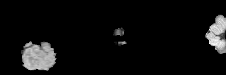

# MRI_Segmentation

MRI Segmentation using U-Net
<!-- TABLE OF CONTENTS -->
<details>
  <summary>Table of Contents</summary>
  <ol>
    <li><a href="#usage">Usage</a>
    <li>
        <a href="#process">Process</a>
        <ul>
            <li><a href="#data-loader">Data Loader</a></li>
            <li><a href="#augmenter">Augmenter</a></li>
            <li><a href="#network">Network</a></li>
            <li><a href="#loss-function">Loss Function</a></li>
            <li><a href="#optimizer">Optimizer</a></li>
        </ul>
    </li>
    <li><a href="#testing-network">Testing Network</a></li>
    <li>
        <a href="#result">Result</a></li>
        <ul>
            <li><a href="#brain-tumor-segmentation">Brain Tumor Segmentation</a></li>
            <li><a href="#hippocampus-segmentation">Hippocampus segmentation</a></li>
        </ul>
    </li>
  </ol>
</details>


## Usage
1. Clone the repository
```sh
git clone <repository_url> your-folder
```
2. Install requirements( It is for CPU. For GPU install GPU PyTorch.)

```sh
python -m venv .venv
source venv\Scripts\activate
pip install -r requirements.txt
```
3. Modify the config.yaml file
4. Run the following code script.
```sh
python main.py
```

<p align="right">(<a href="#MRI_Segmentation">back to top</a>)</p>

## Process


As is evident from the figure, the process starts with preprocessing the collected data. Then, data are located in the 
local database and are used to train the network. The process from getting data from the database to optimizing and 
updating the parameters of data is iterating in every batch. In this  process the network is the heart of the pipeline 
and we aime at make an optimized network which is able to do its given task in a proper way. In this process, the 
network is the heart of the pipeline, and we aim to make an optimized network that is able to do its given task in 
a proper way.

### Data Loader
In loading data, first, we select a number of data from the data name list then we load them from the database and put 
them in a batch. The main challenge of this process is that we have to do something so that the data in each batch be 
unique, that we do this by using Python generators and checking to remove the name of selected data from our datalist.
We also try to patch data to a desired size.


### Augmenter
For augmenting data, we use spatial transformations like rotation and scaling, Gaussian Noise, Gaussian Blur, Brightness
Multiplicative Transformation, Contrast Augmentation, Simulating Low Resolution, Gamma Transformation, and Mirroring to 
some percent of data in the dataset. However, since we want to determine the ability of our network in dealing with 
different deteriorations we do not use this stage in training our networks.

### Network
Currently, we are using a three-depth U-net as a base network. Following picture is the networks that will be trained and tested.
<br>
* Real valued network


### Loss Function
The loss used in the training process is the sum of dice loss (an implementation of dice loss proposed in
[this](https://arxiv.org/abs/1606.04797) paper) and cross-entropy loss.  Networks, moreover, are trained with 
deep supervision.

### Optimizer
For optimization, stochastic gradient descent with the poly learning rate is used.

<p align="right">(<a href="#MRI_Segmentation">back to top</a>)</p>

## Testing Network
After training the networks we aim to test them on deteriorated data which are obtained by the methods proposed in
[FAST-AID Brain](https://arxiv.org/abs/2208.14360). In the following, you can see the effect of each change on a sample
of hippocampus data.
<br>

<p align="center">
  
</p>

<br>

<p align="right">(<a href="#MRI_Segmentation">back to top</a>)</p>

## Result
Here are the result of network trained in previous tests:

### Brain Tumor Segmentation
Train dice score = 78.8%
<br>
Labeled data:
<br>
<p align="center">
  
</p>
<br>
Labeled with predicted labels:
<br>
<p align="center">
  
</p>

### Hippocampus segmentation
Labeled data:
<br>
<p align="center">
  
</p>
<br>
Labeled with predicted labels by real-valued network:
<br>
Train dice score = 82.3%
<br>
<p align="center">
  
</p>

<p align="right">(<a href="#MRI_segmentation">back to top</a>)</p>